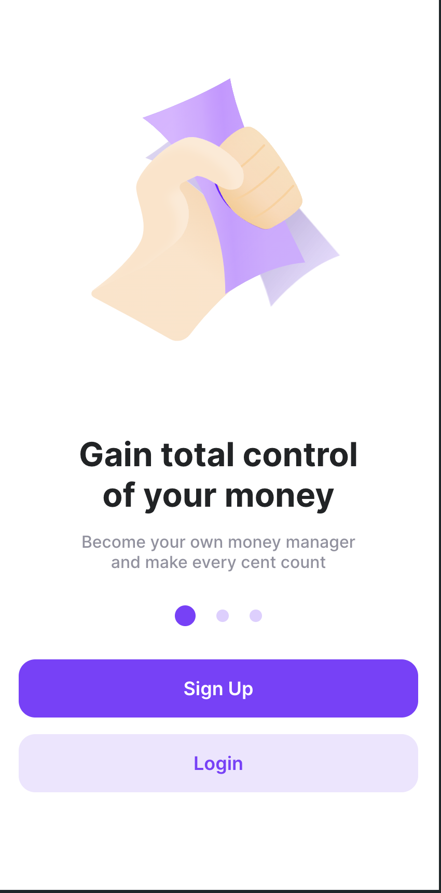
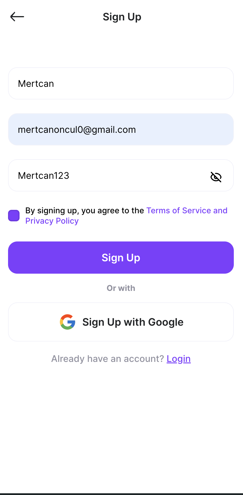
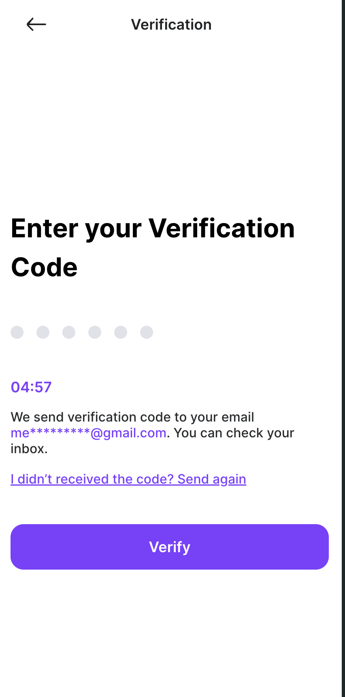
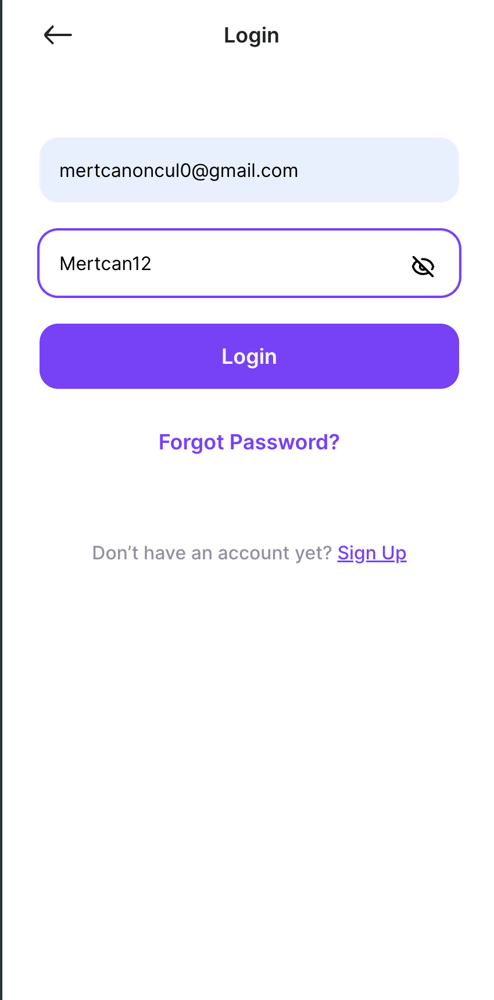
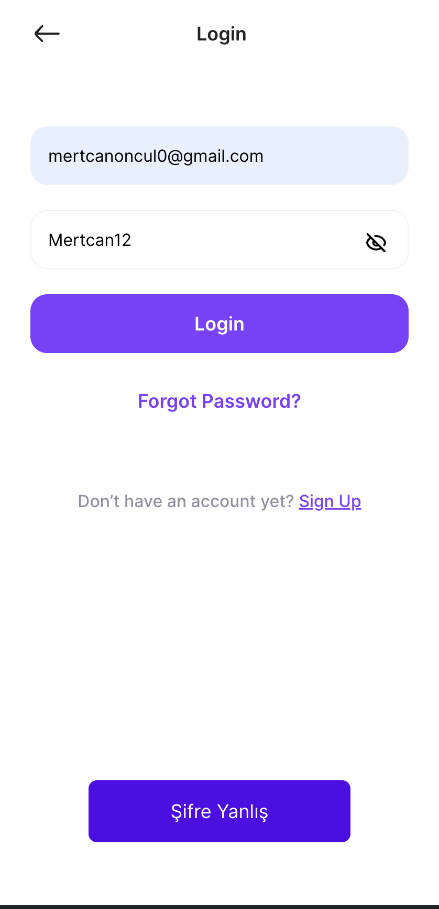
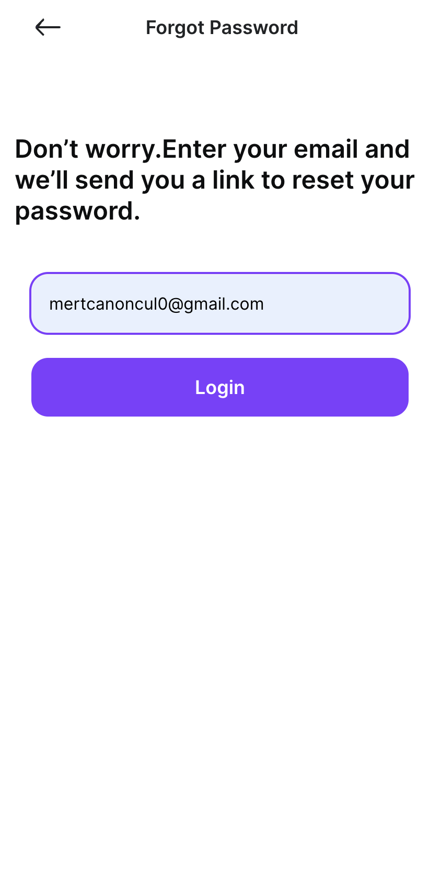
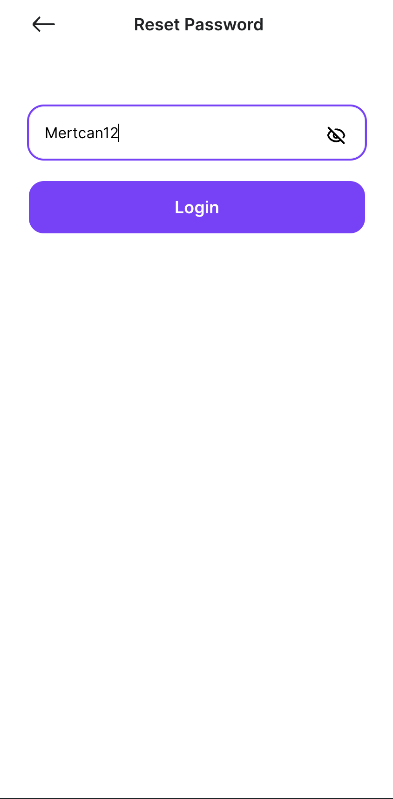

# Authentication App Mern Stack

I had made the parts like the authorization to send e-mails to work according to my knowledge and idea at that time.
October 12, 2023

## Contents

- Login
- Register
- Forgot Password
- Change Password
- Email Auth

# ScreenShots

